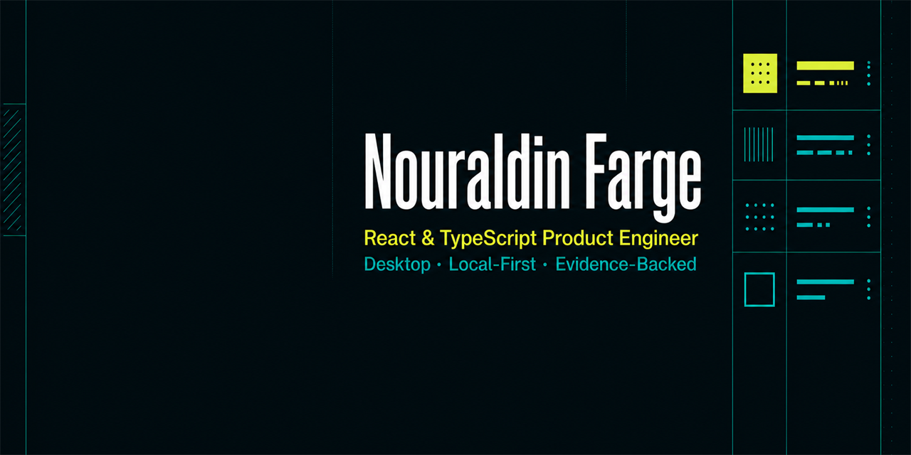

# Nouraldin Farge — portfolio source

[](https://github.com/NouraldinFarge/portfolio-source/actions/workflows/quality.yml)
[](https://github.com/NouraldinFarge/portfolio-source/actions/workflows/codeql.yml)
[](https://nouraldinfarge.github.io)

The maintainable React and TypeScript source for [nouraldinfarge.github.io](https://nouraldinfarge.github.io). The portfolio leads with shipped, evidence-backed work and keeps active public-source prereleases in a clearly separate section so work in progress is never mistaken for a supported release.



## What this repository contains

- A recruiter-focused portfolio built with React, TypeScript, and Vinext.
- A dedicated, synthetic-safe Research Studio case-study route.
- A deterministic exporter that produces a script-free GitHub Pages artifact.
- Desktop and mobile Chrome/Axe checks for WCAG A/AA regressions, landmarks, broken images, and horizontal overflow.
- Rendered-content and self-contained-export tests that reject development-only or local filesystem references.

The generated deployment is intentionally kept in the separate [`NouraldinFarge.github.io`](https://github.com/NouraldinFarge/NouraldinFarge.github.io) repository. Edit this source repository; treat the Pages repository as generated output.

## Portfolio structure

| Area | Purpose |
| --- | --- |
| `/` | Shipped projects, active public-source prereleases, engineering ownership, and contact path |
| `/research-studio/` | Public, source-free case study using redistribution-safe synthetic evidence |
| `public/` | Portfolio-owned static assets and the current résumé PDF |
| `scripts/export-github-pages.mjs` | Script-free, self-contained GitHub Pages export |
| `tests/` | Rendered HTML, export integrity, and Chrome/Axe regression coverage |

## Local development

Requires Node.js 22.13 or newer and Google Chrome for the local accessibility suite.

```bash
npm ci
npm run dev
```

Run the same quality gate used in pull requests:

```bash
npm run check
```

The test suite builds the production artifact, checks rendered content, verifies the static export, and audits both portfolio routes at desktop and mobile viewports. CI installs a locked Playwright Chromium build; local Windows runs use the installed stable Chrome channel.

## GitHub Pages export

Build and export a script-free copy:

```bash
npm run export:pages
```

To write the artifact into a separate Pages checkout:

```bash
npm run export:pages -- ../NouraldinFarge.github.io
```

The exporter copies only referenced styles, fonts, public assets, the résumé, and search metadata. It rejects executable bundles, unsafe paths, local-only references, and missing content, then generates a dedicated `noindex` 404 page.

## Hosting configuration

`.openai/hosting.json` stores the existing Sites project identifier used by the deployment workflow. It is intentionally versioned so deployments update the established project instead of creating duplicates. The file contains no credential; deployment credentials remain outside the repository.

## Engineering and disclosure

- Public claims must point to inspectable source, immutable releases, methodology, or bounded case-study evidence.
- Active source is labeled as prerelease work until its repository-specific release gates close.
- Portfolio media must be owned, licensed, or synthetic-safe and must not expose private datasets or local paths.
- AI agents assist with research, implementation, testing, and iteration. Nouraldin owns product direction, architecture, technical review, validation criteria, safety and licensing boundaries, data-source decisions, and release approval. Agent output is treated as untrusted until repository checks and human review pass.

## Security

Please do not publish suspected vulnerabilities or sensitive information in a public issue. Follow [SECURITY.md](SECURITY.md) to report them privately.

## Contributing

Focused accessibility, compatibility, documentation, and correctness improvements are welcome. See [CONTRIBUTING.md](CONTRIBUTING.md) before opening a pull request.

## License

Source code is available under the [MIT License](LICENSE). Personal portfolio copy, résumé content, branding, and media assets are excluded from that grant; see [CONTENT-LICENSE.md](CONTENT-LICENSE.md).
